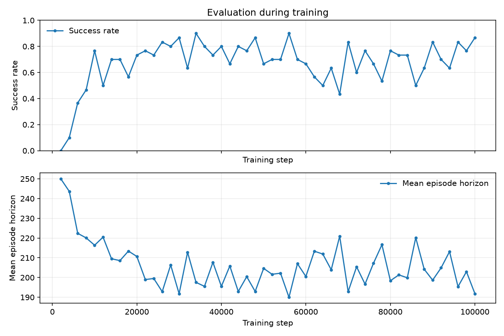
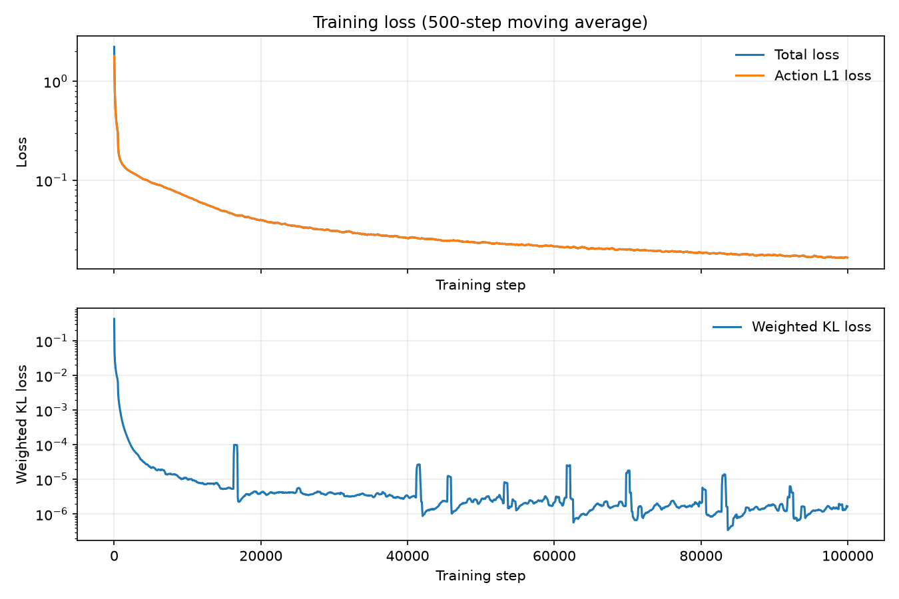
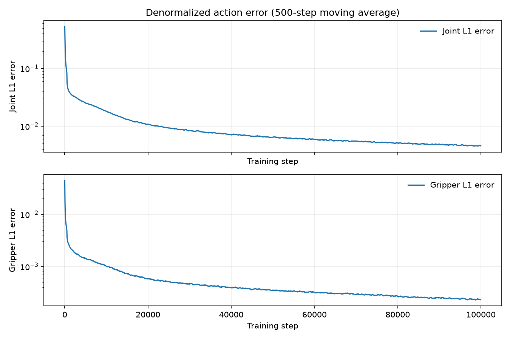

# toy-act

A bare-bones ACT policy implemented from scratch to understand CVAEs, action chunking, temporal ensembling, and attention.

## Rollout

Two-camera policy (batch size 64) on the Can task. The rollout uses the checkpoint at step 56,000, which reached 90% success in training-time evaluation.

### Training run

Evaluation success rate and episode horizon:

Action and KL losses:

Joint and gripper action errors:

Run details

`20260929-195938_bs64_lr1e-04_beta0.01_wu0_st100000_imgagentview_image-robot0_eye_in_hand_image_use_z1_l1`

## Ablations

### Batch size

### Number of cameras

