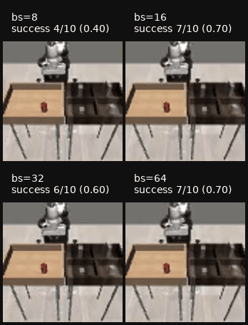
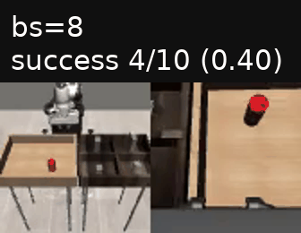
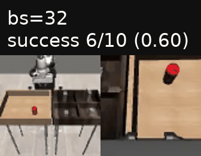

# toy-act

## Two-camera rollout GIFs

Qualitative comparison of the four two-camera ACT v2 runs. Each run is evaluated
with its best checkpoint (the highest training-time `eval/success_rate`), rolled
out for 10 episodes of up to 200 steps in `PickPlaceCan`, and rendered from both
cameras (`agentview` and `robot0_eye_in_hand`). The rollouts are concatenated
into a per-run GIF, and a combined 2x2 GIF shows all four runs side by side. Each
panel is captioned with the run's batch size and its rollout success score.



| Batch | Best checkpoint | Training eval | Rollout (10 ep) |
|-------|-----------------|---------------|-----------------|
| bs8   | `step_000040000.pt` | 0.60 | 4/10 (0.40) |
| bs16  | `step_000052000.pt` | 0.73 | 7/10 (0.70) |
| bs32  | `step_000040000.pt` | 0.90 | 6/10 (0.60) |
| bs64  | `step_000056000.pt` | 0.90 | 7/10 (0.70) |

### Outputs

- `assets/rollout-two-camera/bs{8,16,32,64}_two_camera_rollout.gif` — per-run
  GIFs showing both cameras.
- `assets/rollout-two-camera/two_camera_rollout_2x2.gif` — combined 2x2 grid
  showing the `agentview` camera only.
- `assets/rollout-two-camera/best_checkpoints.json` — manifest of the selected
  checkpoints and scores.
- `assets/rollout-two-camera/_recordings/` — raw per-run mp4s and metadata, kept
  so the GIFs can be rebuilt without re-running the rollouts.

### Per-run GIFs

| bs8 | bs16 |
|-----|------|
|  |  |
| **bs32** | **bs64** |
|  |  |

### Scripts (`scripts/utils/`)

1. `find_best_checkpoints.py` — reads the TensorBoard event files of each run and
   writes the manifest pairing every run with its best `step_*.pt`.
2. `record_rollout_episodes.py` — loads each best checkpoint, runs the rollouts,
   and streams both cameras into per-run mp4 recordings (headless EGL).
3. `build_rollout_gifs.py` — captions the panels and writes the per-run and
   combined GIFs.

### Usage

```bash
# 1. select the best checkpoint of each run
PYTHONPATH=. uv run python scripts/utils/find_best_checkpoints.py \
  --runs-dir runs/act_v2/v4 \
  --output assets/rollout-two-camera/best_checkpoints.json

# 2. record 10 episodes of up to 200 steps per run, both cameras
PYTHONPATH=. uv run python scripts/utils/record_rollout_episodes.py \
  --manifest assets/rollout-two-camera/best_checkpoints.json \
  --out-dir assets/rollout-two-camera/_recordings \
  --episodes 10 --horizon 200

# 3. build the per-run GIFs and the combined 2x2 grid
PYTHONPATH=. uv run python scripts/utils/build_rollout_gifs.py \
  --recordings-dir assets/rollout-two-camera/_recordings \
  --out-dir assets/rollout-two-camera \
  --scale 2 --frame-stride 8 --fps 10

# keep both cameras in the combined grid (default: agentview only)
#   --combined-cameras agentview robot0_eye_in_hand
```

`record_rollout_episodes.py` requires the best checkpoints to be present locally
under `checkpoints/act_v2/<run-name>/`; download them from
`s3://toy-act/checkpoints/act_v2/<run-name>/` first. The default dataset is
`datasets/can/ph/2026-09-29_02-01-42_agentview_robot0_eye_in_hand.hdf5`.
