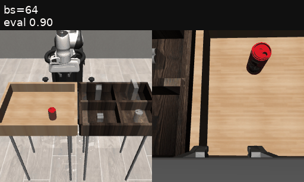
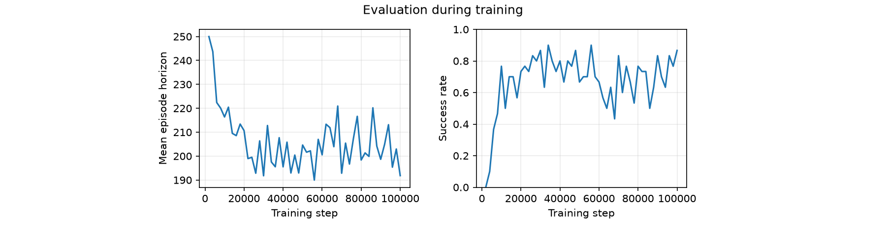
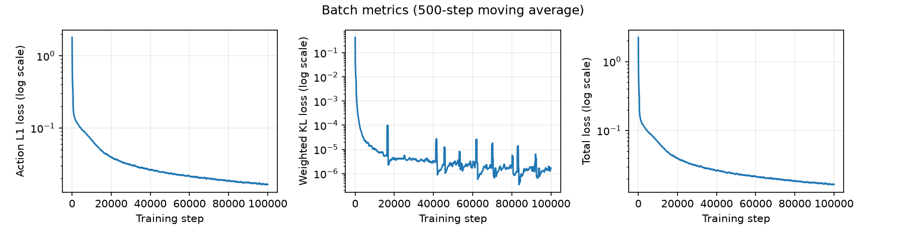
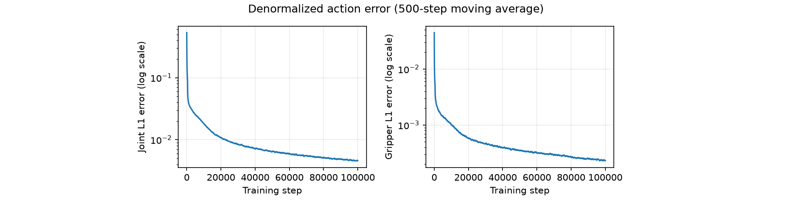
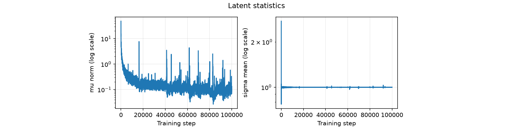
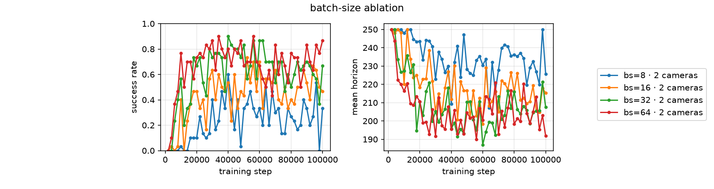
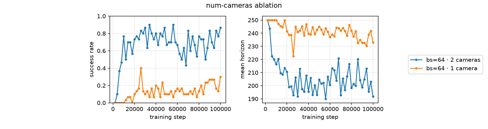

# toy-act

A toy ACT policy implemented from scratch to understand CVAEs, action chunking, temporal ensembling, and attention.

  

## Training curve

| lr | bs | num-steps | beta | action-loss |
| --- | --- | --- | --- | --- |
| 1e-4 | 64 | 100000 | 0.01 | l1 |

## Ablations

### Batch size

  

### Number of cameras

  

